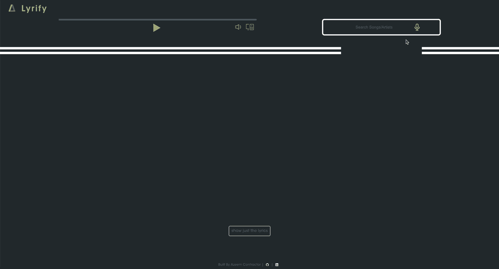

<!-- logo -->

<p align="center">
    
    <h1 align="center"><strong>Lyrify</strong></h1>
</p>

<p align='center' style="font-weight:800"> This is the Client Side of the Project</p></br>

<p align='center'>
    <a href="#motivation">Motivation</a> • 
    <a href="#key-features">Key Features</a> • 
    <a href="#how-to-install">How To Install</a> • 
    <a href="#live-view">Live View</a> • 
    <a href="#tech-dependencies">Tech Dependencies</a> • 
    <a href="#demo">Demo</a> • 
    <a href="#next-steps">Next Steps</a> • 
    <a href="#credits">Credits</a>
</p></br>

# Motivation

<p>Music is the language without barriers, in recent years, we are seeing an uptrend of this in the music we listen to, BTS, a Korean boy band is considered a high achiever of having their music play across radio stations globally. Back in 2002, Macarena was charting as top dance song. Though the songs are great, unless you are native to the language, it is difficult to understand what is the meaning behind the song's lyrics. On the otherside we have English songs, whose lyrics everyone is curious to learn as the artist of the song intended to write. An example of this is SAINt JHN - Roses (Imanbek Remix)</br></br>Lyrify will help bridge that gap by displaying the lyrics for every song searched via Spotify as well for the non-english songs, provide a translation so everyone can read the thoughts conveyed via the music.</p></br>

# Key Features

<p align="center">Client Side</p>
<p> Lyrics and Translation for non-english song are displayed simultaneously or seperately based on requirement of the user</p>
<p>Search displays upto 20 results for user to find the right song</p>
<p> Spotify Web Player allows user to connect to devices other than the Web Player, example: Mobile or Google Speaker</p></br>

---

<p align="center"><a href="https://github.com/azmanosis/lyrify-capstone-api">Server Side</a></p>
<p>API calls are made only when song search is Unique. If Song is found in JSON, Lyrify displays from the JSON instead of calling API</p>
<p>Translation API is called and only occurs for non-english songs</p>
<p> Spotify Web Player automatically expires after 10 minutes, thereby limiting potential API calls</p></br>

# How To Install

To Run the Program on the Client Side <strong>Please ensure [Server Side](https://github.com/azmanosis/lyrify-capstone-api) is set up and running</strong> then follow the instructions below:

Open an IDE program, preferable VS Code.</br>Under `Terminal` in `VS Code` select `New Terminal`

```bash
# Clone this repository
$ git clone https://github.com/azmanosis/lyrify-capstone.git
# Go into the folder
$ cd lyrify-capstone
# Install dependencies
$ npm install
# Run the app
$ npm start
```

<p>Open <a href="http://localhost:3000">http://localhost:3000</a> in a browser to view the app</p></br>

# Live View

<strong>[Lyrify](https://lyrify.up.railway.app/) is Live!</strong>

Lyrify has come to life on any web browser, thanks to the host support from [railway](https://railway.app/). Both the client side and the [server side](https://github.com/azmanosis/lyrify-capstone-api) are deployed via the railway app. However during testing, i ran into a few notable discrepencies due to which i am unable to guarantee the use of the live version for Lyrify.

Some notable issues are:

> Spotify supports Digital Rights Management (DRM). DRM is used to protect an organization's digital media from unauthorized use and to ensure a company retains control over the distribution of digital content.</br>
> Spotify player may not be available if DRM permissions are not granted on your device.</br>
> As a Test, Firefox for mobile ask for permission and if you allow, the player will show on the page.</br>
> Please refer to <a href="https://support.google.com/chrome/answer/4410268?hl=en-GB&co=GENIE.Platform%3DAndroid">article</a> for Google Chrome browser errors.</br>

</br>

# Tech Dependencies

Installed via `npm install` in previous step</br>

<a href="https://reactjs.org/" target="_blank" rel="noreferrer"></a>
<a href="https://reactrouter.com/en/main" target="_blank" rel="noreferrer"></a>
<a href="https://axios-http.com/docs/intro" target="_blank" rel="noreferrer"></a>
<a href="https://sass-lang.com/" target="_blank" rel="noreferrer"></a></br>

<p>spotify web playback, spotify-web-api</p>

# Demo

<p align='center'>
    
</p>
</br>

# Next Steps

While the Lyrify app is certainly enjoyable, there are some aspects that could be optimized to make it even more engaging and satisfying for users.

Here are a few ideas i'd like to implement to enhance your experience on Lyrify.

> Allow lyrify to listen and identify music by using its microphone feature. Currently it is limited to voice input.</br>
> Set up a database for the numerous request passed to Lyrify.</br>
> Allow users to add and edit their own lyrics, therby expanding the database and not relying on the API entirely.</br>
> Allow users to switch translation into any language of their choice instead of the default English.</br>
> Add more pages that allow users to explore their curated Spotify Playlist for easier choosing of songs

</br>

# Credits:

<p>Support and guidance from the BrainStation Educators and TA's</p>
